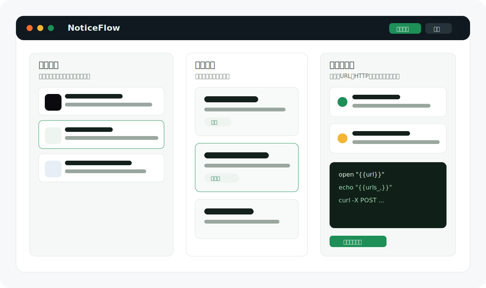

# NoticeFlow

[](https://github.com/NotoChen/NoticeFlow/actions/workflows/ci.yml)
[](https://github.com/NotoChen/NoticeFlow/actions/workflows/release-macos.yml)
[](https://github.com/NotoChen/NoticeFlow/releases/latest)
[](./LICENSE)
[](#运行要求)

NoticeFlow 是一个本地优先的 macOS 通知自动化工具。它读取本机系统通知，按你配置的规则匹配内容，并执行打开链接、启动应用、发送本地通知、HTTP 请求、本地脚本等动作。

适合把“被动看到通知”变成“自动处理通知”：提取通知中的链接、转发关键消息、按应用触发脚本、记录动作结果，或把原本需要手工复制粘贴的通知流接入自己的本地工作流。

<p>
  <a href="https://notochen.github.io/NoticeFlow/">官网</a>
  ·
  <a href="https://github.com/NotoChen/NoticeFlow/releases/latest">下载最新版</a>
  ·
  <a href="https://github.com/NotoChen/NoticeFlow/issues">反馈问题</a>
</p>



## 项目状态

- 当前阶段：早期可用版本，版本号仍在 `0.x`。
- 当前平台：只面向 macOS，最低支持 macOS 12。
- 当前分发：通过 GitHub Releases 发布未签名 DMG，首次启动需要手动允许打开。
- 当前更新：已接入 Tauri updater，应用设置中提供手动检查更新。
- 当前重点：本地可靠性、规则表达能力、执行反馈、开源分发体验。

## 目录

- [快速开始](#快速开始)
- [适合场景](#适合场景)
- [核心能力](#核心能力)
- [变量与动作](#变量与动作)
- [权限、隐私与安全](#权限隐私与安全)
- [故障排查](#故障排查)
- [本地开发](#本地开发)
- [项目结构](#项目结构)
- [路线图](#路线图)

## 快速开始

1. 从 [GitHub Releases](https://github.com/NotoChen/NoticeFlow/releases/latest) 下载对应芯片的 macOS DMG（Apple Silicon 选 `aarch64`，Intel 选 `x64`）。
2. 打开应用。如果 macOS 拦截未签名应用，在 **系统设置 > 隐私与安全性 > 仍要打开** 中允许。
3. 授予完全磁盘访问权限，用于读取本机 `usernoted` 通知数据库。
4. 在通知列表中选择一条样本通知。
5. 新建规则，配置应用、文本、正则、URL 或时间条件。
6. 添加动作，例如打开 URL、执行脚本、发送 HTTP 请求或本地通知。
7. 点击「测试」做干跑：检查规则命中并预览变量替换后的动作参数，确认无误后可在结果面板中真实执行。
8. 在执行历史页查看每次执行的结果、脚本输出和错误信息，可按规则、状态、来源筛选。

关闭主窗口后 NoticeFlow 会退到菜单栏托盘继续运行并隐藏 Dock 图标，点击托盘图标可重新打开主界面。

## 适合场景

- 监控类通知：从告警、构建、CI、客服、IM 通知中提取链接并打开或转发。
- 本地脚本编排：通知到达后执行 Python、JavaScript、Shell 或 AppleScript。
- 个人效率流：把重复点击、复制链接、打开页面等动作交给规则处理。
- 轻量集成：通过 HTTP 动作把特定通知发送到自建 webhook。
- 通知整理：本地归档、隐藏、删除不需要长期展示的通知记录。

## 核心能力

| 能力 | 说明 |
| --- | --- |
| 通知读取 | 读取本机 macOS 通知数据库，并维护 NoticeFlow 自己的本地归档 |
| 规则匹配 | 支持应用、文本、正则、URL、时间窗口等条件组合 |
| 变量提取 | 支持标题、正文、应用、URL 集合、时间和自定义正则捕获 |
| 动作执行 | 支持打开链接、启动应用、本地通知、HTTP 请求、本地脚本 |
| 脚本路径 | 可选择本地脚本路径，也可直接配置 Bash 或 Zsh 命令 |
| 执行反馈 | 动作执行后记录结果、stdout/stderr 输出和耗时，执行历史支持按规则、状态、来源筛选 |
| 数据目录 | 支持配置数据目录，并对过宽路径做保护 |
| 自动更新 | 使用 GitHub Releases 上的 Tauri updater 产物检查更新 |

## 变量与动作

常用变量：

| 变量 | 含义 |
| --- | --- |
| `{{title}}` | 通知标题 |
| `{{subtitle}}` | 通知副标题 |
| `{{body}}` | 通知正文 |
| `{{app}}` | 应用名称或应用标识 |
| `{{url}}` | 通知中识别到的第一个 URL |
| `{{urls}}` | 所有 URL，默认用空格拼接 |
| `{{urls_,}}` | 所有 URL，用逗号拼接 |
| `{{time}}` | 通知时间 |
| 自定义变量 | 通过正则捕获从通知内容中提取 |

示例：打开通知中的第一个 URL。

```bash
open "{{url}}"
```

示例：把所有 URL 交给本地脚本处理。

```bash
/Users/me/scripts/handle-links.py {{urls}}
```

示例：把通知内容发送到 webhook。

```bash
curl -X POST https://example.com/hook \
  -H "Content-Type: application/json" \
  -d '{"title":"{{title}}","body":"{{body}}","app":"{{app}}"}'
```

## 权限、隐私与安全

NoticeFlow 按本地优先方式设计，默认不会把通知内容发送到远程服务。

- 读取通知历史需要完全磁盘访问权限。
- 自动化规则和设置保存在本机。
- 通知归档保存在 NoticeFlow 数据目录下的 `notifications.sqlite`。
- HTTP 动作、webhook 和脚本由用户配置，可能把数据发送到外部服务。
- 删除系统通知记录是显式用户操作，会写入本机 macOS 通知数据库。
- 本地脚本以当前用户权限执行，规则应视为可执行配置。

更多细节见 [PRIVACY.md](./PRIVACY.md) 和 [SECURITY.md](./SECURITY.md)。

## 故障排查

### 看不到系统通知

- 确认 NoticeFlow 已获得完全磁盘访问权限。
- 确认系统通知数据库中确实有新通知。
- 如果 macOS 的 `usernoted` 缓存异常，可以重启应用或重启 `usernoted` 后再刷新。

### 规则没有命中

- 先用通知样本测试规则草稿。
- 确认应用标识没有选错。
- 正则语法以 Rust `regex` 引擎为准，不支持 look-around 和 backreference。
- 空匹配条件不会作为推荐配置使用，建议至少配置一个明确条件。

### 脚本可以在终端运行，但在 NoticeFlow 中失败

- 把动作的 Shell 模式改成「登录」（默认值），它会加载 `.zprofile` / `.bash_profile` 并继承终端 PATH；「标准」模式是干净环境，PATH 里没有 Homebrew 等自装工具。
- 依赖 alias 或 shell 函数时选「交互」或「登录 + 交互」模式，或把逻辑放进脚本文件。
- 使用脚本绝对路径，避免依赖当前目录。
- 明确写出需要的环境变量和 PATH。
- 查看执行历史中的 stdout、stderr 和退出码。

### 首次打开被 macOS 拦截

当前 DMG 未做 Apple Developer ID 签名和公证。首次启动时需要在 **系统设置 > 隐私与安全性** 中手动允许打开。

## 运行要求

- macOS 12 或更高版本。
- 完全磁盘访问权限。
- Node.js 24 和 Rust stable 只在本地开发时需要。

## 本地开发

```bash
npm install
npm run tauri:dev
```

提交前建议运行：

```bash
npm run build
cd src-tauri && cargo test
cd src-tauri && cargo clippy --all-targets -- -D warnings
```

## 项目结构

```text
src/
  features/notifications/   通知列表与通知操作
  features/rules/           规则卡片、规则编辑、规则测试
  features/settings/        设置、维护、更新检查
  hooks/                    前端状态与交互逻辑
  lib/                      前端模型与 Tauri 命令封装

src-tauri/src/
  notification_db.rs        读取 macOS 通知数据库
  notification_archive.rs   NoticeFlow 本地通知归档
  rules.rs                  规则持久化、校验和匹配
  variables.rs              通知变量和正则捕获
  action_runner.rs          动作执行、脚本、HTTP 和输出处理
  app_settings.rs           设置、数据目录和安全边界
  app_catalog.rs            本机应用列表和图标缓存
```

## 构建与发布

构建本地应用包：

```bash
npm run build
npm run tauri:build
```

构建带自动更新产物的 macOS release 包：

```bash
export TAURI_SIGNING_PRIVATE_KEY="$(cat secrets/noticeflow-updater.key)"
export TAURI_SIGNING_PRIVATE_KEY_PASSWORD=""
npm run tauri:build:mac:release
```

推送 `v*` tag 会触发 `Release macOS` workflow：

```bash
git tag v0.1.0
git push origin v0.1.0
```

发布检查清单维护在 [docs/release.md](./docs/release.md)。

## 路线图

以下方向会按实际使用反馈推进，不承诺固定时间：

- 更完整的动作模板和变量预览。
- 更清晰的规则命中解释和调试视图。
- 更完善的通知归档筛选和批量操作。
- Apple Developer ID 签名和公证。
- 更完整的真实截图、演示动图和使用案例文档。

## 贡献

欢迎提交 issue 和 pull request。贡献前请阅读 [CONTRIBUTING.md](./CONTRIBUTING.md)。

## 许可证

MIT，见 [LICENSE](./LICENSE)。
